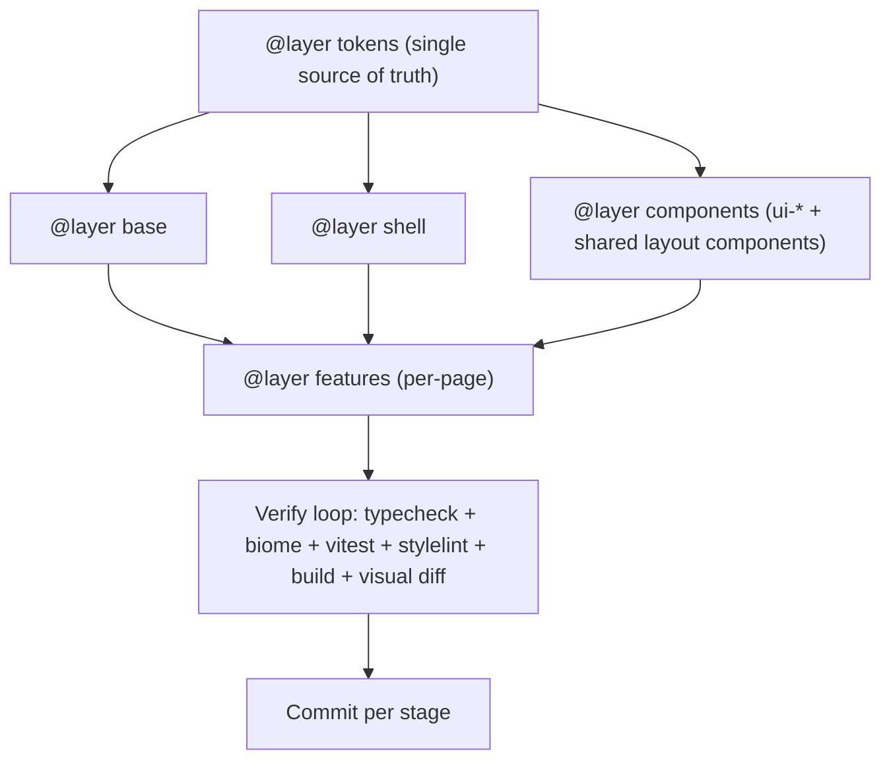

# Hub Premium Redesign

Full visual overhaul of the BTV Hub dashboard (`apps/hub`), keeping the dark identity but elevating it to feel premium and crafted. Approach is **token-first** and **fix-as-we-go**: redesign tokens and shared chrome so every page upgrades at once, while aggressively refactoring and optimizing the code (CSS architecture + a shared component system) for long-term maintainability. Every stage is guarded by automated checks and committed before moving on.

## Design decisions (applied)

- **Vanilla CSS + existing token system** — no framework swap.
- **CSS-only motion**, gated by `prefers-reduced-motion`. No JS animation library.
- **Offline fonts** via bundled `@fontsource` (local-first; no CDN).
- **Preserve functional keyframes** (`fade-in`, `pop-in`, `glitch-reveal`, etc.) — they render real overlay output; relocated unchanged, never altered.
- Dark-only. No new product features — purely visual/interaction/refactor.
- **Aggressive future-proofing**: single-source-of-truth tokens, CSS `@layer` cascade, feature-split stylesheets, consolidated keyframes, dead-code removal, and a shared layout component system.
- **Per-stage git commits** on a dedicated branch for safe, granular rollback.

## Risk-mitigation and quality strategy

Woven into every stage, not bolted on at the end:

- **Dedicated branch + per-stage commits.** Work on `redesign/premium-ui`; commit only after a stage passes the full verification loop, so any stage rolls back independently. Keep commits small and atomic.
- **Strengthened verification loop (must be green before every commit):**
  - `pnpm typecheck`
  - `pnpm lint` + `pnpm format:check` (Biome)
  - `pnpm test` (Vitest — existing suites, e.g. `apps/hub/src/api.test.ts`)
  - **Stylelint** (new) — enforces design-token usage, bans raw hex outside `tokens.css`, flags duplicate/dead rules
  - `pnpm build` (catches bundling/CSS errors; check output size for regressions)
  - **Automated visual-regression screenshots** (new) — per-page snapshots compared each stage; review every diff and only accept intentional changes
- **Behavior never changes** — only styling and structure-for-styling. Functional logic, routes, and overlay-output keyframes stay intact.
- **Refactor guards:** the TSX component refactor is adopted **one page at a time**, re-running tests + visual regression after each adoption; lightweight render smoke tests are added for each new shared component to lock its contract.
- **Single source of truth for tokens.** Canonical tokens defined once; legacy names become thin aliases, then references migrate off them so aliases can be removed cleanly.
- **Predictable cascade via CSS `@layer`** (`tokens, base, shell, components, features, utilities`).

## Code refactor and optimization goals

- **Shared component system (heavy refactor)** to remove duplication and future-proof:
  - `SplitWorkspace` — the repeated master-detail pattern (`webhook-workspace`, `macro-workspace`, `widgets-workspace`, `automation-rule-workspace`).
  - `PageGrid` / `CardGrid` — the many `*-grid` auto-fit layouts (`integrations-grid`, `plugins-grid`, `live-dashboard-grid`, etc.).
  - `Tabs` / `SegmentedControl` — unify `section-tabs`, `AlertsSectionTabs`, `segmented`.
  - `MeterBar` + `ControlGrid` — shared by the live overlay control pages (boss/chaos/prediction/tournament).
  - Adopt incrementally; each adoption is verified independently.
- **CSS optimization:** feature-split for smaller, focused files; remove dead/duplicate rules; replace stray hex with tokens; consolidate scattered keyframes; use `backdrop-filter` sparingly; consider `content-visibility: auto` for long lists.
- **JS/bundle optimization:** preserve existing route-level code-splitting (lazy pages), ensure shared components don't bloat shared chunks, and memoize where extraction could add re-renders. Compare build output size before/after.

## How the cascade and safety net fit together

## Stage 0 - Safety net, tooling, and scaffolding

- Create `redesign/premium-ui` branch.
- Add **Stylelint** config (token enforcement, no raw hex outside `tokens.css`, dead/duplicate rule detection) and an `npm` script; add **visual-regression** screenshot harness with baselines for all routes.
- Capture baseline screenshots of key pages (Dashboard, Alerts, Integrations, Setup, Alert Editor) and confirm a clean run of the full verification loop.
- Introduce CSS cascade layers in `apps/hub/src/styles.css`: declare `@layer tokens, base, shell, components, features, utilities;` and wrap imports into the correct layers (no visual change — structural groundwork).
- Commit.

## Stage 1 - Tokens as single source of truth

File: `apps/hub/src/styles/foundation.css` (`:root`) -> extracted into `styles/tokens.css`.

- Canonical token set: deepened canvas, neutral + elevated-surface ramps (1px top highlights), enriched accent + paired gradient accent, layered elevation shadows (ambient + key), soft accent glow.
- Type scale (display + body), tabular numerals, refined spacing/line-height.
- Motion tokens: `--duration-fast/normal/slow`, standard/emphasized easings, reusable transition shorthands.
- Define all currently-undefined tokens (`--color-accent`, `--color-surface`, `--color-surface-muted`, `--color-surface-subtle`, `--color-text-tertiary`, `--color-bg-page`, `--duration-normal`).
- Make legacy names (`--bg`, `--text`, `--accent`...) aliases of canonical tokens.
- Bundle `@fontsource` fonts; wire into `--font-display` / body.
- Verify + commit.

## Stage 2 - App shell and navigation (cutting-edge nav)

Files: shell styles (extracted to `styles/shell.css`), `apps/hub/src/App.tsx`.

- Glass sidebar + sticky glass topbar (`backdrop-filter`, used sparingly).
- Animated active nav indicator, smooth section expand/collapse, refined headers/chevron.
- Cohesive topbar control cluster (status pills, save indicator, palette/hotkeys/emergency).
- Tighten `.main` layout rhythm (max-width, padding, breathing room).
- Subtle route-change entrance (fade + rise).
- Verify + commit.

## Stage 3 - Shared UI primitives

File: UI kit styles (extracted to `styles/components.css`), driving `apps/hub/src/ui/`.

- Refine `.ui-button` (+ add `ui-button__spinner`), `.ui-card` (hover glow), `.ui-status-pill` (+ neutral tone), `.ui-callout`, `.ui-form-field`, `.ui-empty-state`, `.ui-skeleton`.
- Add unstyled hooks: `ui-error-card`, `ui-card-header__action`, `ui-page-header__action`.
- Verify + commit.

## Stage 4 - Shared layout component system (heavy refactor)

New components under `apps/hub/src/ui/`: `SplitWorkspace`, `PageGrid`/`CardGrid`, `Tabs`/`SegmentedControl`, `MeterBar`, `ControlGrid`.

- Build each with a render smoke test, then adopt page-by-page (Webhooks, Macros, Widgets, Automations for `SplitWorkspace`; Integrations/Plugins/Dashboard for grids; Alerts/Automations for tabs; Boss/Chaos/Prediction/Tournament for meters).
- After each page adoption: re-run tests + visual regression; commit.

## Stage 5 - Stylesheet split, polish, and token migration

Restructure large stylesheets into `apps/hub/src/styles/features/` (alerts, automation, macros, webhooks, activity, stream-deck, live, setup, integrations, commands, mobile, interactive, plugins, widgets, overlay-editor). While splitting each chunk:

- Align to new tokens; migrate references off legacy aliases to canonical tokens.
- Replace stray hex with tokens; remove dead/duplicate rules (Stylelint-assisted).
- Add tasteful micro-interactions.
- Move functional overlay keyframes **unchanged** into `styles/overlay-animations.css`; consolidate UI keyframes into `styles/keyframes.css`.
- Sources split: `workflows.css`, `stream-deck.css`, `live-and-tools.css`, `widgets.css`; legacy alert editor route removed and current editor support styles moved out of the legacy bundle.
- Verify + commit per feature group.

## Stage 6 - Page-level refinement

Complex workspaces first (Alert Editor, Overlays, Widgets, Macros, Automations, Plugins, Stream Deck, Live Dashboard, Mobile Control), then simple pages: consistent spacing, master-detail layouts, responsive `@media`, clean navigability. CSS-first; minimal `.tsx` hooks. Verify + commit per group.

## Stage 7 - Motion, cleanup, and final verification

- Subtle entrance/stagger animations; refine hover/focus/active; verify all collapse under `prefers-reduced-motion`.
- Remove now-unused legacy token aliases (final debt cleanup).
- Dead-CSS + dead-code sweep; confirm bundle/CSS size has not regressed.
- Full verification loop + complete visual QA across all pages.
- Update `docs/architecture.md` with a design-system/token + shared-component reference.
- Final commit + open PR from `redesign/premium-ui`.

## Notes / risks

- Aggressive scope (file splits + token migration + component refactor) touches many files; the automated verification loop, per-page adoption, and per-stage commits are what keep it safe.
- Heavy class reuse means token changes ripple everywhere; visual-regression diffing catches unintended drift that manual review would miss.
- Functional overlay keyframes are relocated but never edited.

## Surface inventory (reference)

- ~7,200 lines of CSS across 7 files (`styles.css` is an import barrel).
- 11 shared UI primitives in `apps/hub/src/ui/`.
- 25 pages (14 simple card/form layouts, 10 complex workspaces, 1 re-export).

## Step-by-step task checklist

> Run the full verification loop before each commit: `pnpm typecheck` -> `pnpm lint` + `pnpm format:check` -> `pnpm test` -> `pnpm stylelint` -> `pnpm build` -> visual-regression diff review.

### Stage 0 - Safety net, tooling, and scaffolding

- [x] Create and check out the `redesign/premium-ui` branch.
- [x] Add Stylelint dev dependency and a `stylelint` script in `package.json`.
- [x] Create a Stylelint config that enforces design-token usage, bans raw hex outside `tokens.css`, and flags dead/duplicate rules.
- [x] Add the visual-regression screenshot harness (dev dependency, config, and `test:visual` script).
- [x] Capture baseline screenshots for all routes (Dashboard, Mobile Control, Activity, Recaps, Overlays, Widgets, Alerts, Alert Routing, Alert Editor, Interactive, Commands, Automations, Macros, Webhooks, Stream Deck, Channel Points, Soundboard, Tournament, Predictions, Boss Fight, Chat Chaos, Plugins, Integrations, Setup).
- [x] Declare `@layer tokens, base, shell, components, features, utilities;` and wrap current imports in `apps/hub/src/styles.css` into the correct layers (no visual change).
- [x] Run the full verification loop; confirm a clean baseline.
- [x] Commit: `chore(hub): redesign safety net, tooling, and cascade layers`.

### Stage 1 - Tokens as single source of truth

- [x] Extract the `:root` tokens from `foundation.css` into `apps/hub/src/styles/tokens.css` (under `@layer tokens`).
- [x] Define the canonical color system: canvas, neutral ramp, elevated-surface ramp (with 1px top highlights), enriched accent + paired gradient accent.
- [x] Add layered elevation shadows (ambient + key) and a soft accent-glow token.
- [x] Add the type scale (display + body), enable tabular numerals, refine letter-spacing/line-height tokens.
- [x] Add motion tokens: `--duration-fast/normal/slow`, standard/emphasized easings, reusable transition shorthands.
- [x] Define all currently-undefined tokens (`--color-accent`, `--color-surface`, `--color-surface-muted`, `--color-surface-subtle`, `--color-text-tertiary`, `--color-bg-page`, `--duration-normal`).
- [x] Re-point legacy names (`--bg`, `--text`, `--accent`, `--border`, `--surface*`, etc.) as aliases of canonical tokens.
- [x] Add `@fontsource` font packages; wire into `--font-display` and the body font.
- [x] Run the verification loop; review visual diffs (intentional global refresh).
- [x] Commit: `feat(hub): canonical design tokens + bundled fonts`.

### Stage 2 - App shell and navigation

- [x] Extract shell styles into `apps/hub/src/styles/shell.css` (under `@layer shell`).
- [x] Apply glass treatment to the sidebar and a sticky glass topbar (sparing `backdrop-filter`).
- [x] Implement the animated active nav indicator on `.nav-link.active`.
- [x] Smooth the section expand/collapse and refine section headers/chevron in `App.tsx` markup as needed.
- [x] Group the topbar controls (status pills, save indicator, command palette, hotkeys, emergency) into a cohesive cluster.
- [x] Tighten `.main` layout rhythm (max-width, padding, vertical/horizontal spacing).
- [x] Add a subtle route-change entrance (fade + rise) on the page container.
- [x] Run the verification loop; review nav/shell visual diffs.
- [x] Commit: `feat(hub): premium app shell + cutting-edge navigation`.

### Stage 3 - Shared UI primitives

- [x] Extract UI-kit styles into `apps/hub/src/styles/components.css` (under `@layer components`).
- [x] Refine `.ui-button` variants/press/hover/focus and add the missing `.ui-button__spinner`.
- [x] Refine `.ui-card` (hover glow, header) and `.ui-card-header__action`.
- [x] Add `.ui-status-pill--neutral` tone and refine all pill tones.
- [x] Refine `.ui-callout`, `.ui-form-field`, `.ui-empty-state`, `.ui-skeleton`.
- [x] Add styles for `.ui-error-card` and `.ui-page-header__action`.
- [x] Run the verification loop; review primitive visual diffs.
- [x] Commit: `feat(hub): refined shared UI primitives`.

### Stage 4 - Shared layout component system (heavy refactor)

- [x] Build `SplitWorkspace` (master-detail) + render smoke test.
- [x] Build `PageGrid`/`CardGrid` (auto-fit) + render smoke test.
- [x] Build `Tabs`/`SegmentedControl` + render smoke test.
- [x] Build `MeterBar` + render smoke test.
- [x] Build `ControlGrid` + render smoke test.
- [x] Export new components from `apps/hub/src/ui/index.ts`.
- [x] Adopt `SplitWorkspace` in Webhooks; verify (tests + visual) and commit.
- [x] Adopt `SplitWorkspace` in Macros; verify and commit.
- [x] Adopt `SplitWorkspace` in Widgets; verify and commit.
- [x] Adopt `SplitWorkspace` in Automations; verify and commit.
- [x] Adopt `PageGrid`/`CardGrid` in Integrations, Plugins, and the Live Dashboard; verify and commit.
- [x] Adopt `Tabs`/`SegmentedControl` in Alerts and Automations; verify and commit.
- [x] Adopt `MeterBar` + `ControlGrid` in Boss Fight, Chat Chaos, Predictions, Tournament; verify and commit.

### Stage 5 - Stylesheet split, polish, and token migration

- [x] Create `apps/hub/src/styles/features/` and `styles/overlay-animations.css` + `styles/keyframes.css`.
- [x] Move functional overlay-output keyframes from `legacy-editor.css` into `overlay-animations.css` unchanged; consolidate UI keyframes into `keyframes.css`.
- [x] Split + migrate `workflows.css` (alerts, automation, macros, webhooks, activity); verify + commit.
- [x] Split + migrate `stream-deck.css`; verify + commit.
- [x] Split + migrate `live-and-tools.css` (live, setup, integrations, commands, mobile, interactive, plugins); verify + commit.
- [x] Split + migrate `widgets.css` (widgets workspace, theme editor, typography helpers); verify + commit.
- [x] Remove legacy alert editor route and move remaining current editor support styles out of `legacy-editor.css`; verify + commit.
- [x] In each split: migrate references off legacy token aliases, replace stray hex with tokens, and remove dead/duplicate rules (Stylelint-assisted).
- [x] Update `styles.css` imports to the new feature files.

### Stage 6 - Page-level refinement

- [x] Refine Alert Editor layout and editor chrome; verify + commit.
- [x] Refine Overlays (layout editor + URL grids); verify + commit.
- [x] Refine Widgets workspace; verify + commit.
- [x] Refine Macros and Automations workspaces; verify + commit.
- [x] Refine Plugins and Stream Deck; verify + commit.
- [x] Refine Live Dashboard and Mobile Control; verify + commit.
- [ ] Refine the simple pages (Integrations, Setup, Activity, Recaps, Commands, Channel Points, Soundboard, Boss/Chaos/Prediction/Tournament, Alert Projects, Alert Routing); verify + commit.
- [x] Confirm responsive `@media` behavior holds at the existing breakpoints.

### Stage 7 - Motion, cleanup, and final verification

- [x] Add subtle entrance/stagger animations for cards/lists; refine hover/focus/active states.
- [x] Verify every animation collapses correctly under `prefers-reduced-motion`.
- [x] Remove now-unused legacy token aliases (confirm zero references first).
- [ ] Run a dead-CSS/dead-code sweep across the new feature files.
- [ ] Compare bundle and CSS output size against the baseline; confirm no regression.
- [ ] Run the full verification loop and a complete visual QA pass across all pages.
- [ ] Update `docs/architecture.md` with a design-system/token + shared-component reference.
- [ ] Final commit and open a PR from `redesign/premium-ui`.
- Existing tooling: Biome (`lint`, `format:check`), Vitest (`test`), `typecheck`, `build`. No CSS lint or visual regression yet (added in Stage 0).
